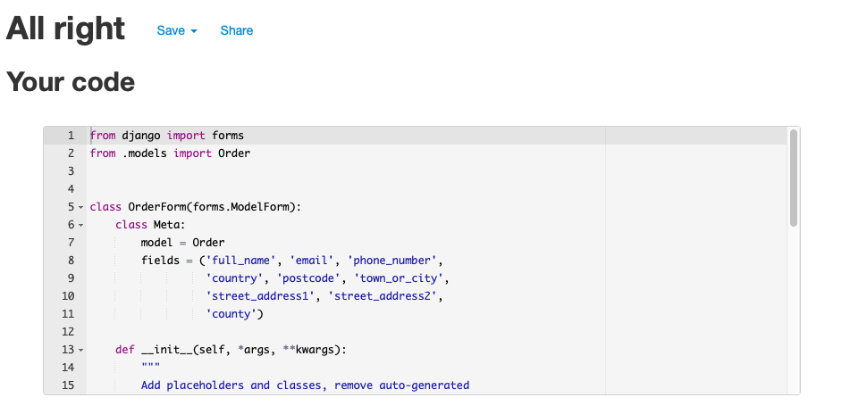
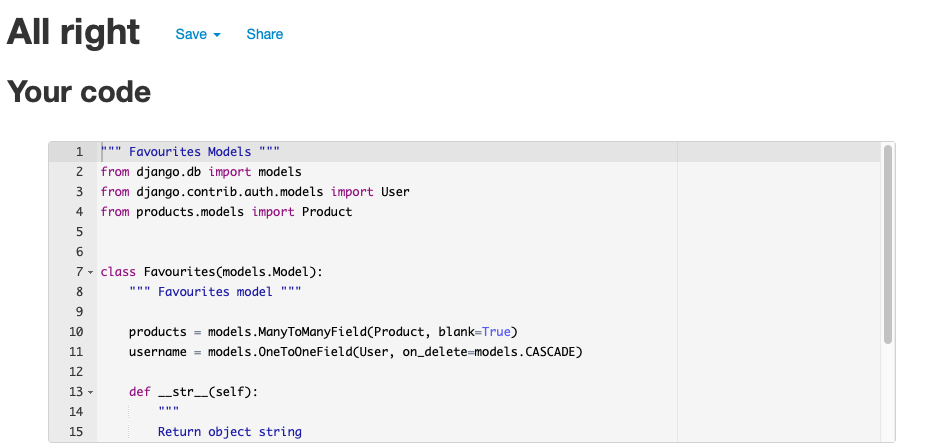
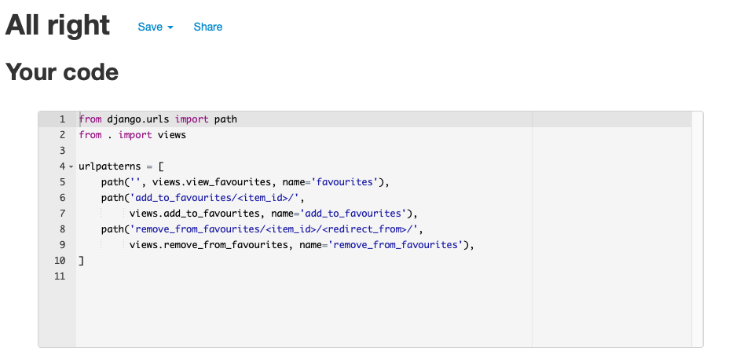
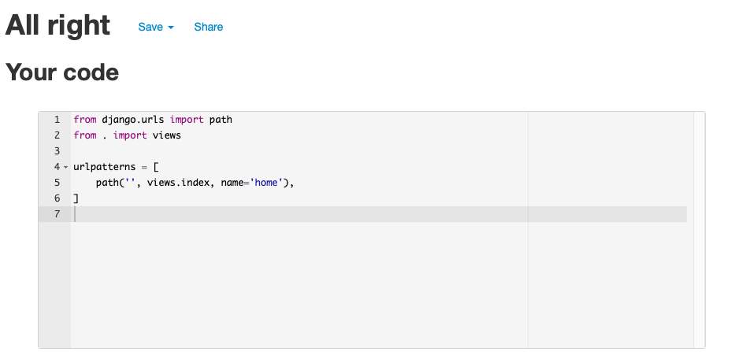
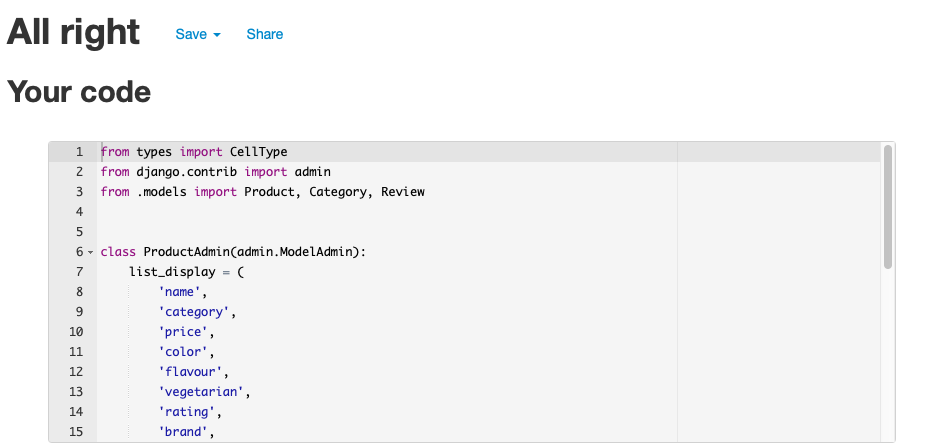
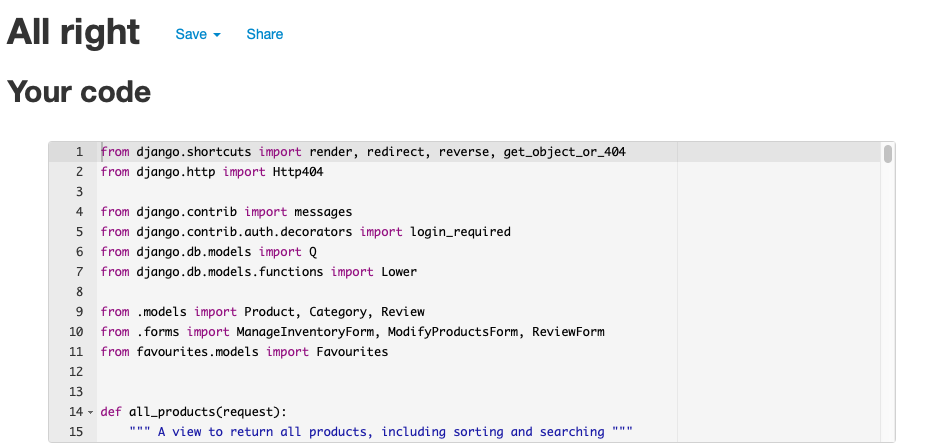
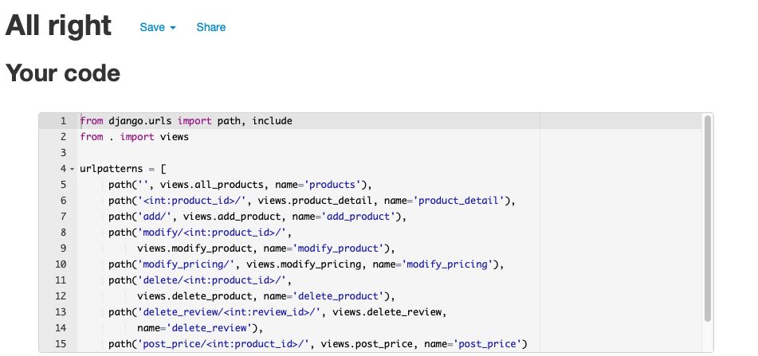
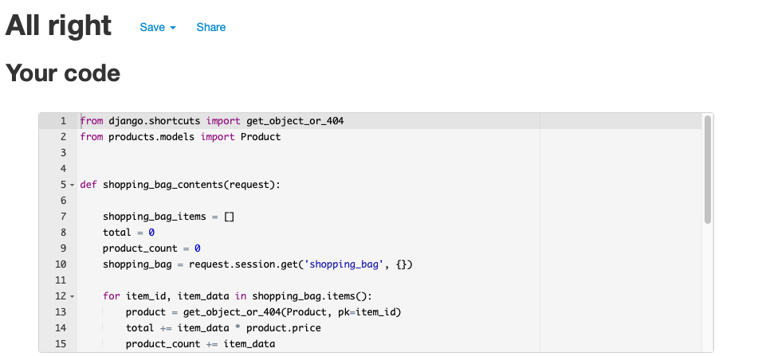

# Testing

## Table of Contents

- Google's Lighthouse Performance
- HTML Validation
- CSS Validation
- JS Validation
- PEP8 Validation
- Manual Testing
- Automated Testing
- Responsive Testing
- Bugs

## HTML Validation - https://validator.w3.org/
---

Home

All Products

Product Detail

Add Products

Manage Inventory

My Profile

My Favourites

Shopping Bag (Empty)

Shopping Bag (Items)

Checkout

## CSS Validation - https://jigsaw.w3.org/css-validator/validator.html.en
---

## PEP 8 Validation - http://pep8online.com/
---

#### Checkout
- Admin.py

- Forms.py

- Models.py

- Urls.py

- Views.py

- Webhook handler.py
- There seems to be an issue with the webhook handler where it is causing errors on the tab indentation. I have reformatted the document as indent with tabs instead of spaces. Since the warnings do not effect the site at all I have elected to ignore the issue .

- Webhook.py
- In the webhook.py file an error is causes due to line length. The readability would be greatly reduced if I was to ammend this issue and Django allows an extension to 99 characters in certain circumstances. Therefore it is best to overlook this issue

#### Favourites
- Models.py

- Urls.py

- Views.py

#### Home

- Urls.py

- Views.py

#### Products

- admin.py

- forms.py

- models.py

- urls.py

- views.py

- widgets.py

#### Profiles

- forms.py

- models.py

- urls.py

- views.py

#### Shopping Bag

- contexts.py

- urls.py

- views.py

## Manual Testing
---

## Automated Testing
---
Automated Unit Testing werer carried out using Django's inbuilt testing tools. Tools were written to cover a large variety of the site. Below Are instructions on how to run the tests, with an overview of the __29__ tests.

Before testing can begin the database needs to be disabled. To do this we need to go into the env.py file and comment out the "DATABASE_URL" value which should be mapped to our postgres database. Once this is done, you can run the tests with the following command.

Terminal Command : python3 manage.py test

It is important to note the file structure required for the tests. Within each application there needs to be a folder called "test", as an example the checkout folder stucture is as follows : sweet_shop/checkout/test/*test_xxx_xxx.py*. Within the test file there also needs to be a blank dunder init file.

### Checkout Appication (11)
    - Forms (6)
        - test_full_name_required                       [Passed]
        - test_email_required                           [Passed]
        - test_phone_number_required                    [Passed]
        - test_street_address_required                  [Passed]
        - test_town_or_city_required                    [Passed]
        - test_country_is_required                      [Passed]
    - Models (1)
        - test_order_string                             [Passed]
    - Urls (3)
        - test_response_of_checkout_page                [Passed]
        - test_response_of_checkout_success_page        [Passed]
        - test_response_of_cache_checkout_data          [Passed]
    - Views (1)
        - test_empty_bag_error                          [Passed]

### Favourite Appication (4)
    - Models (1)
        - test_favourites_string_method                 [Passed]
    - Views (3)
        - test_get_product_favourites_page              [Passed]
        - test_add_product_to_favourites                [Passed]
        - test_remove_product_from_favourites           [Passed]

### Home Appication (1)
    - Views (1)
        - test_page_access                              [Passed]

### Products Appication (7)
    - Models (2)
        - test_category_returns_name                    [Passed]
        - test_product_returns_name                     [Passed]
    - Views (5)
        - test_user_count                               [Passed]
        - test_url_response                             [Passed]
        - test_get_all_products                         [Passed]
        - test_superuser_can_add_product                [Passed]
        - test_non_superuser_can_not_add_product        [Passed]

### Profiles Appication (3)
    - Models (1)
        - test_profile_string_method                    [Passed]
    - Views (2)
        - test_url_response                             [Passed]
        - test_profile_view_template                    [Passed]

### Shopping Bag Appication (2)
    - Views (2)
        - test_add_to_bag                               [Passed]
        - test_remove_item_from_bag                     [Passed]

## Responsive Testing

## Bugs
---

## Known Issues

- Highlighted when created the unit tests, accessing the product detail page fails for products that do not have images. This is not an issue in production as they cannot phyisically get to the page from the all products page. Products that do not have images will also not show up on the home page for non superusers

## Pylint and Flake8 Errros

- Line errors will occur when lines are deemed to be longer then 79 characters. As a general rule, for all the files i have created, all lines that exceed the 79 characters have been shortened unless, it has a detremential effect on readability or causes bugs. In these situations a leniency to 99 characters has been allowed.

## Credentials
---
To test higher functionality of the site, the admin credentials found below can be used

__Username : admin__

__Password : admin-password__

To test lower functionality the user can register for an account on the site.
